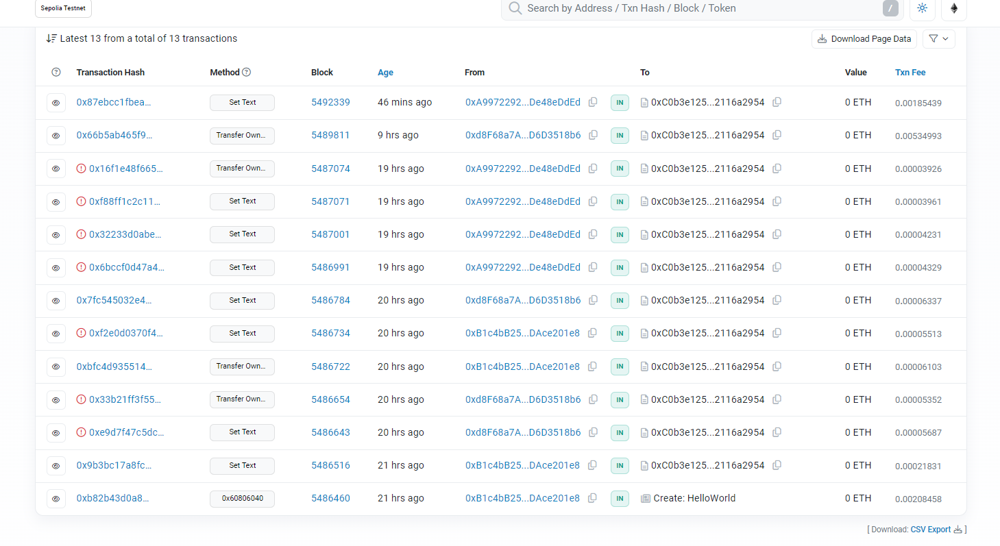
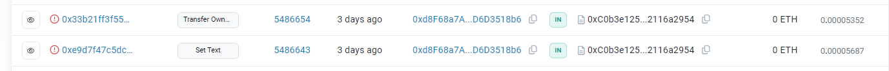
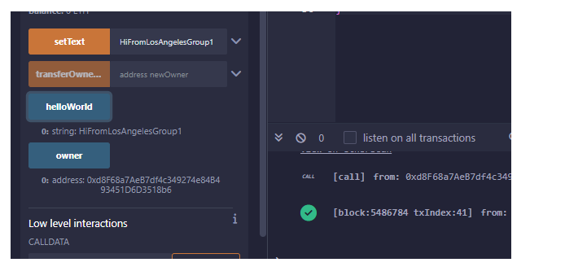
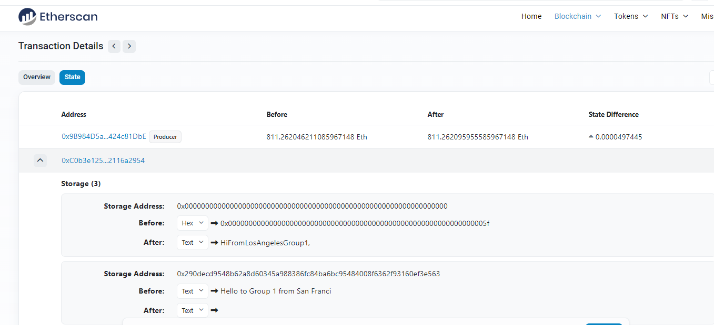
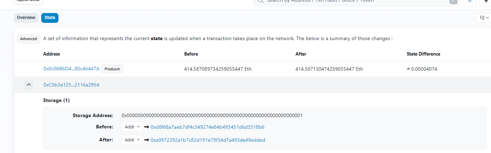
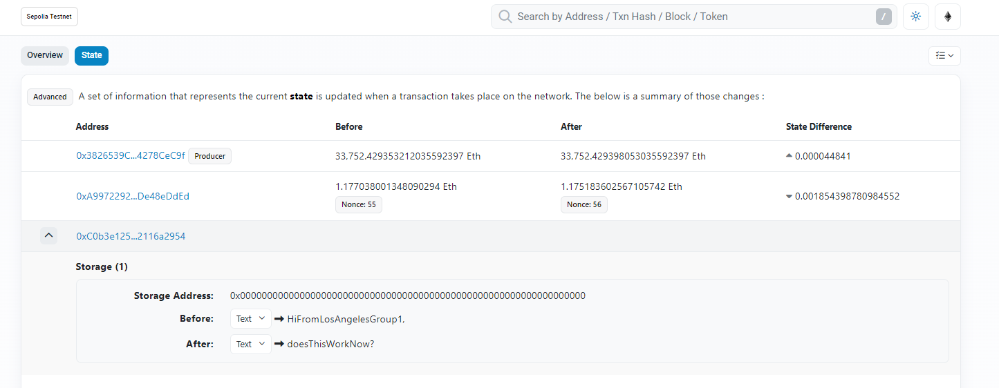
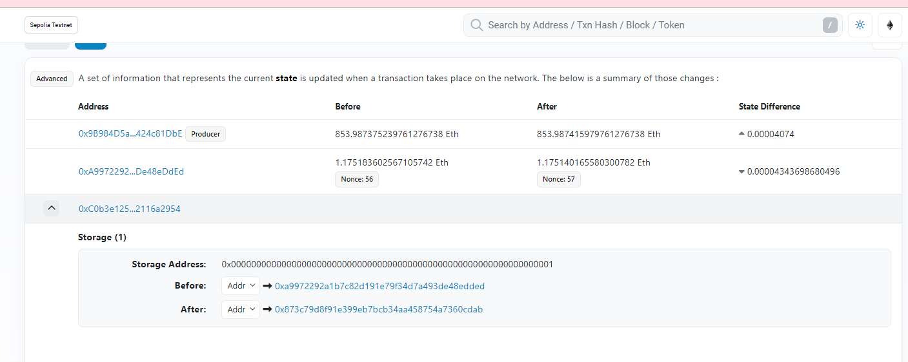
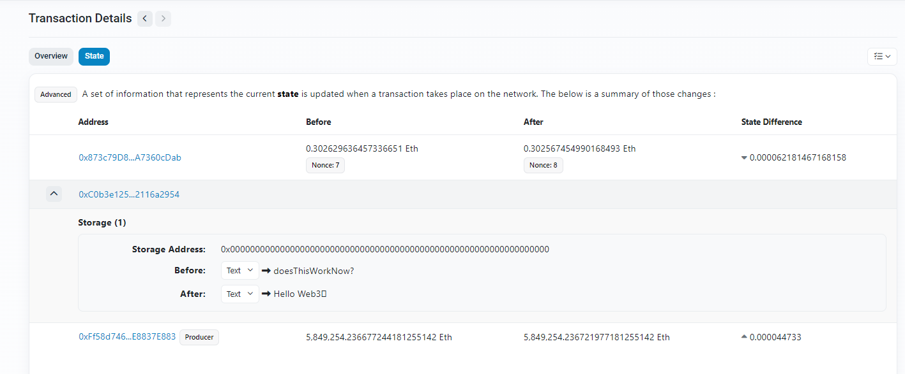
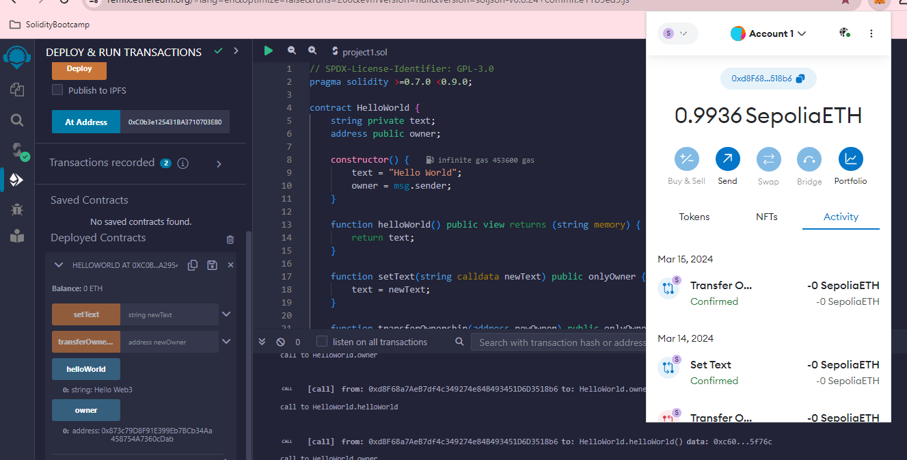

# Solidity Bootcamp 24Q1

## Group 1 - homework 1 

### HelloWorld Contract: 0xC0b3e125431BA3710703E8019f0C5ab2116a2954

#### State

This project traces HelloWorld Contact that holds state of `owner` and `text`.

#### Functions

Only Owner can set text, and also transfer ownership.

Anyone can execute `helloworld()` function which displays the text.

Below describes whole sequence of 4 wallets who start with 1 owner and demo-ing how only owner can set text and also transfer ownership and how each owner sets Text and then transfers ownership to next owner. Anyone can view the text.

### First Owner -  `0xB1c4bB25346ad3F3de0019AE75eEa1ADAce201e8`

below is the contract deployed by address - `0xB1c4bB25346ad3F3de0019AE75eEa1ADAce201e8`

https://sepolia.etherscan.io/address/0xC0b3e125431BA3710703E8019f0C5ab2116a2954

- caller: 0xB1c4bB25346ad3F3de0019AE75eEa1ADAce201e8 (Joezari's wallet address)

  - Transaction Hash: 0xb82b43d0a86f23c5c946a41d9afd8b0e7b367440f3bf1ba36c78b97e1b2ef19e

    - Creation of contract (0xC0b3e125431BA3710703E8019f0C5ab2116a2954)
    - Success
  - Transaction Hash: 0x9b3bc17a8fccd0a94fdd1d7e86205226daac38f0429b2bd1137f4aa49c63aee3
  
    - called setText()
    - Success: because I am the current owner
  
  
  
  next before transfer of ownership wallet `0xd8F68a7AeB7df4c349274e84B493451D6D3518b6` (chuck) tried to set Text and also try transfer ownership and both fail. Below are the 2 Txns on Etherscan
  
  

  
  
  

### 2nd owner -  `0xd8F68a7AeB7df4c349274e84B493451D6D3518b6`

- Transaction hash: 0xbfc4d93551467ec0d8ada1497c71b5235246a30f18fbd22f6af2976361662d14

  - Transfer of ownership to wallet `0xd8F68a7AeB7df4c349274e84B493451D6D3518b6`
  - Success: transferred to a valid address (0xC0b3e125431BA3710703E8019f0C5ab2116a2954 - Chuck's)

1st former owner tries to set Text but fails since no longer owner

- Transaction Hash: 0xf2e0d0370f4c8b1371330d498f14297365c999ef9f9e88e0796abbd05608cd9b
  - called setText()
  - Failed: because I am no longer the owner, setText() has a modifier that checks if the caller of the function is the owner of the contract
  - Error: Fail with error 'Caller is not the owner'

#### 2nd owner set text

2nd owner now `0xd8F68a7AeB7df4c349274e84B493451D6D3518b6`

now works 

https://sepolia.etherscan.io/tx/0x7fc545032e48eaa7f4e9311793422cb26ff57b5d1498f212fe7f4be8740636c3#statechange

### 3rd Owner - `0xa9972292a1b7c82d191e79f34d7a493de48edded`

Change ownership to 3rd wallet 

https://sepolia.etherscan.io/tx/0x66b5ab465f96b6c97cf8fb4e9260c92f829f558528f96a8608e95a28eeb013f1#statechange

#### 3rd wallet set Text - 

https://sepolia.etherscan.io/tx/0x87ebcc1fbea825cfc86fe0642aa9b770cfb701757b0d65309ee20deda5c64935

### 4th wallet - `0x873c79D8F91E399Eb7BCb34Aa458754A7360cDab`

https://sepolia.etherscan.io/tx/0x58a882350733467cf8d1bf9891b3a052b6e2230bdc2622eadf53d3ef110aaa27#statechange

3rd wallet transfers ownership to 4th wallet - 

#### 4th owner Set Text

sets text to "Hello Web3"

### HelloWorld from non owner 2nd wallet

current owner is `0x873c79D8F91E399Eb7BCb34Aa458754A7360cDab` 

HelloWorld function can be called and you see that text now is "Hello Web3" which wallet 4 set it.

